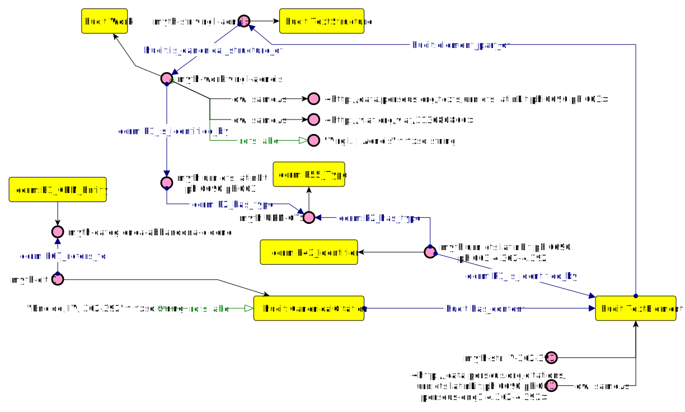

# Mythologiae Datamodel 

[img]

Considering the first and second layer of the datamodel (based on mima + paper JLIS)
For the sake of simplicity, Mythologiae Datamodel has been tested in modules. Those modules are named 'What', 'Where', 'When', 'Where'. It is worth to underline that this research main interest is to investigate the 'What' dimension, taking into consideration how it interacts with the other three modules. 
In particular, the 'What' dimension represents how citations mentioning works and items are linked together through the use of conceptual categories. 'When', 'Where' and 'Who' can be seen 
as three modules of addition information aiming to investigate in toto the 'What' dimension. 

# WHAT
## Items 

## Citations
Citations (Canonical Citations) has been modelled through the use of hucit.  

Example in natural language: "The passage "Eneide, IV, 362-392" refers to the abandon of Dido By Eneas". 

## Works
## Conceptual Categories

